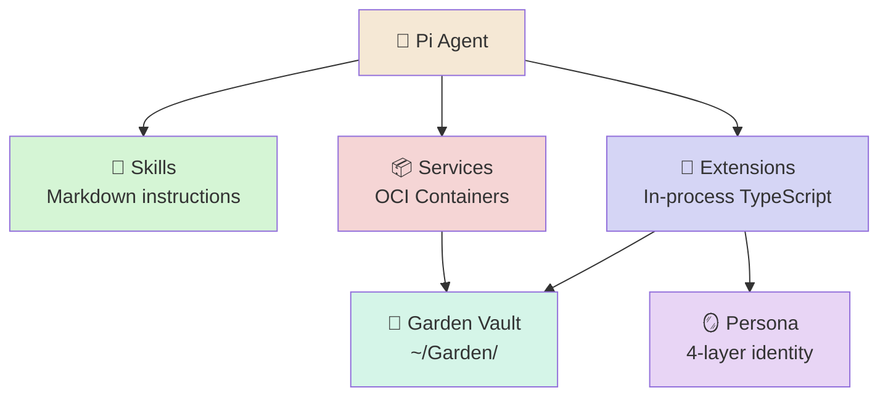

# piBloom

> 📖 [Emoji Legend](docs/LEGEND.md)

A personal AI companion that lives on a quiet box on your shelf or on a repove VPS, your choice. piBloom is a Fedora bootc OS image that makes [Pi](https://github.com/nicholasgasior/pi-coding-agent) a first-class citizen — extending it with knowledge of its host, a persistent memory store, and a growing identity that evolves alongside you.

You "plant" your mini-PC and over time it grows and blooms with you.

## 🌱 What It Is

Bloom is a **Pi package** — a bundle of extensions, skills, and services that teach Pi about its environment. When installed on a Fedora bootc system, Pi becomes a sovereign personal AI that:

- **Remembers** — flat-file object store with YAML frontmatter, organized using PARA methodology
- **Journals** — daily entries that build a shared narrative over time
- **Manages its own OS** — bootc updates, rollbacks, container lifecycle, systemd services
- **Communicates** — channel bridges (WhatsApp via Baileys) over Unix socket IPC
- **Evolves** — structured self-improvement workflow, persona that grows from Seed to Bloom
- **Stays private** — no cloud, no telemetry. Your thoughts never leave your box.

## 🌱 Architecture

Bloom extends Pi through three mechanisms, lightest first:

| Layer | What | When |
|-------|------|------|
| **Skill** | Markdown instructions (SKILL.md) | Pi needs knowledge or a procedure |
| **Extension** | In-process TypeScript module | Pi needs tools, commands, or event hooks |
| **Service** | OCI container (Podman Quadlet) | Standalone workload needing isolation |

Always prefer the lightest option.



### 🧩 Extensions

| Extension | Purpose |
|-----------|---------|
| `bloom-persona` | Identity injection, safety guardrails, compaction guidance |
| `bloom-audit` | Tool-call audit trail, retention, and review |
| `bloom-os` | bootc, Podman, systemd management |
| `bloom-services` | Service lifecycle (scaffold, publish, install, test) |
| `bloom-objects` | Flat-file memory store (CRUD with YAML frontmatter) |
| `bloom-journal` | Daily journal entries |
| `bloom-garden` | Garden vault, blueprint seeding, skill discovery |
| `bloom-channels` | Channel bridge Unix socket server |
| `bloom-topics` | Topic management and session organization |

### 📜 Skills

| Skill | Purpose |
|-------|---------|
| `first-boot` | One-time system setup guide |
| `os-operations` | System health inspection and remediation |
| `object-store` | CRUD operations for the memory store |
| `service-management` | Install, manage, and discover OCI service packages |
| `self-evolution` | Structured system change workflow |
| `recovery` | System recovery procedures |

### 📦 Services

Modular capabilities packaged as OCI artifacts, installed via `oras` from GHCR:

| Service | What |
|---------|------|
| `bloom-svc-whisper` | Speech-to-text (faster-whisper) |
| `bloom-svc-whatsapp` | WhatsApp bridge (Baileys) |
| `bloom-svc-tailscale` | Mesh VPN |
| `bloom-svc-syncthing` | P2P vault sync |

### 🪞 Persona

Bloom has an [OpenPersona](persona/) 4-layer identity seeded to `~/Garden/Bloom/Persona/` on first boot:

- **SOUL.md** — Identity, values, voice, boundaries
- **BODY.md** — Channel adaptation, presence behavior
- **FACULTY.md** — Reasoning patterns, PARA methodology
- **SKILL.md** — Current capabilities inventory

### 🌿 Garden

The Garden (`~/Garden/`) is Bloom's persistent vault — a PARA-organized directory structure synced across devices via Syncthing:

```
~/Garden/
├── Inbox/        # Unprocessed items
├── Projects/     # Active, deadline-driven work
├── Areas/        # Ongoing responsibilities
├── Resources/    # Reference material
├── Archive/      # Completed items
└── Bloom/        # Shared persona, skills, evolutions
```

## 🗂️ Project Structure

```
bloom/
├── extensions/       # TypeScript Pi extensions
├── lib/              # Shared utilities (frontmatter, logging, paths)
├── skills/           # SKILL.md procedure guides
├── services/         # OCI service packages
├── persona/          # OpenPersona 4-layer identity
├── os/               # Fedora bootc 42 image (Containerfile + config)
├── tests/            # Unit, integration, and e2e tests
├── docs/             # Architecture and deployment guides
├── guardrails.yaml   # Safety rules for tool execution
└── justfile          # Build, image generation, VM management
```

## 🚀 Getting Started

### 🤖 Install as a Pi Package

```bash
pi install /path/to/bloom
```

### 💻 Development

```bash
npm install
npm run build          # tsc --build
npm run check          # biome lint + format check
npm run check:fix      # biome auto-fix
npm run test           # vitest
npm run test:coverage  # with 80% threshold enforcement
```

Load extensions directly for development:

```bash
pi -e ./extensions/bloom-persona.ts \
   -e ./extensions/bloom-audit.ts \
   -e ./extensions/bloom-os.ts \
   -e ./extensions/bloom-services.ts \
   -e ./extensions/bloom-objects.ts \
   -e ./extensions/bloom-journal.ts \
   -e ./extensions/bloom-garden.ts \
   -e ./extensions/bloom-channels.ts \
   -e ./extensions/bloom-topics.ts
```

### 💻 Build the OS Image

Requires: `sudo dnf install just qemu-system-x86 edk2-ovmf`

```bash
just build             # podman build container image
just qcow2             # generate qcow2 disk image
just iso               # generate Anaconda installer ISO
just vm                # boot in QEMU (graphical + SSH on :2222)
just vm-ssh            # ssh into running VM
just vm-kill           # stop VM
just clean             # remove os/output/
```

### 🚀 First Boot

Once the OS is running, the `first-boot` skill walks through setup:

1. Configure LLM provider + API key
2. GitHub authentication
3. Device git identity
4. Syncthing setup (core sync service)
5. Optional services (WhatsApp, Whisper, Tailscale)

See [docs/pibloom-setup.md](docs/pibloom-setup.md) for the full guide.

## 💻 OS Image

The Bloom OS image (`os/Containerfile`) is based on **Fedora bootc 42** and includes:

- **Runtime**: Node.js, Pi, Claude Code
- **Containers**: Podman, Buildah, Skopeo, oras
- **Desktop**: Sway (Wayland), greetd, foot terminal, wayvnc
- **Dev tools**: git, gh, ripgrep, fd, bat, VS Code
- **User**: `bloom` with rootless Podman and passwordless sudo for first-boot

Atomic updates via `bootc upgrade` with automatic rollback support.

## 📖 Conventions

- **TypeScript**: strict, ES2022, NodeNext
- **Formatting**: Biome (tabs, double quotes, 120 line width)
- **Containers**: `Containerfile` (not Dockerfile), `podman` (not docker)
- **Extensions**: `export default function(pi: ExtensionAPI) { ... }` pattern
- **Skills**: SKILL.md with YAML frontmatter

## 📖 Docs

- [Service Architecture](docs/service-architecture.md) — extensibility hierarchy details
- [Quick Deploy](docs/quick_deploy.md) — OS build and deployment
- [First Boot Setup](docs/pibloom-setup.md) — initial configuration guide
- [Channel Protocol](docs/channel-protocol.md) — Unix socket IPC spec
- [Supply Chain](docs/supply-chain.md) — artifact trust and releases
- [Fleet PR Workflow](docs/fleet-pr-workflow.md) — multi-device contribution flow

## 🔗 Related

- [Emoji Legend](docs/LEGEND.md) — Notation reference
- [AGENTS.md](AGENTS.md) — Extension, tool, and hook reference
- [Service Architecture](docs/service-architecture.md) — Extensibility hierarchy details
- [UI Protocol](docs/ui-protocol.md) — Headless web UI protocol spec
- [Headless Web UI Plan](docs/headless-web-ui-plan.md) — Web UI implementation plan
