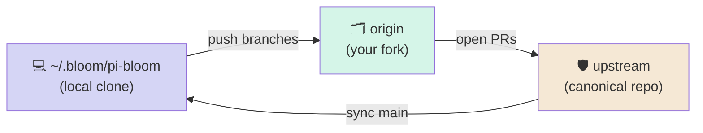
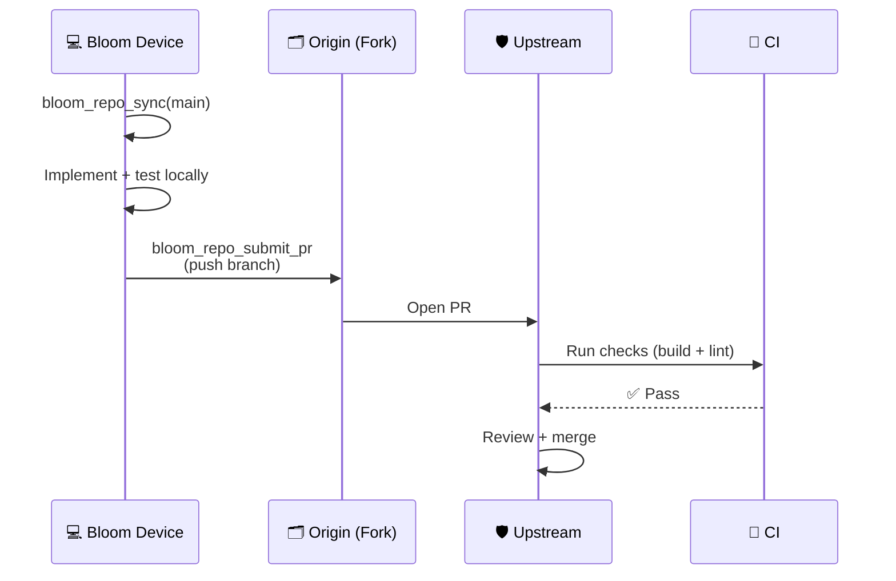

# Fleet Contribution Workflow (Repo as Source of Truth)

> 📖 [Emoji Legend](LEGEND.md)

This document describes how to run Bloom as a multi-device contributor system while keeping a single canonical repository as source of truth.

For quick execution steps, see `docs/fleet-bootstrap-checklist.md`.

## 🌱 Principle

- Canonical state lives in one upstream repository (`upstream/main`).
- Devices never push directly to `upstream/main`.
- Devices push branches to their fork (`origin`) and open pull requests to upstream.
- Merges happen only after CI + review.

This gives you both:
- local autonomy on every Bloom host, and
- centralized correctness through PR governance.

---

## 1) 🛡️ Upstream Repository Governance

Configure these once in GitHub settings:

1. Protect `main`
   - Require pull request before merge
   - Require status checks to pass
   - Require at least one approval
   - Block force push + branch deletion
2. Enable CODEOWNERS (recommended)
3. Require linear history (optional but clean)

### 🚀 Required CI check

Use workflow: `.github/workflows/pr-validate.yml`

Expected checks:
- TypeScript build (`npm run build`)
- Biome validation (`npm run check`)

---

## 2) 💻 Device Bootstrapping (one-time per machine)

### 💻 Prerequisites

- `gh auth login` completed on the device
- access to upstream repo
- writable fork (or ability to create one)

### 🤖 Tool-first setup

Run:

1. `bloom_repo_configure(repo_url="https://github.com/<owner>/pi-bloom.git")`
2. `bloom_repo_status`
3. `bloom_repo_sync(branch="main")`

Optional explicit fork:

- `bloom_repo_configure(..., fork_url="https://github.com/<you>/pi-bloom.git")`

### 🤖 What `bloom_repo_configure` does

- Ensures `~/.bloom/pi-bloom` exists (clones if missing)
- Sets/updates `upstream`
- Sets/updates `origin` (fork URL if provided)
- Attempts gh-assisted fork remote setup when possible
- Sets repo-local git identity (`user.name`, `user.email`)

---

## 3) 🚀 Day-to-day Device Fix Flow

When a Bloom host identifies a bug and applies a fix:

1. Check readiness
   - `bloom_repo_status`
2. Sync main
   - `bloom_repo_sync(branch="main")`
3. Implement and test locally
   - run `npm run build && npm run check` in repo
4. Submit PR in one step
   - `bloom_repo_submit_pr(title="fix: ...", body="...")`

`bloom_repo_submit_pr` handles:
- branch naming/creation
- staging + commit
- push to `origin`
- PR creation against `upstream`

Output includes PR URL for review.

---

## 4) 📖 Recommended Naming Conventions

### 📖 Branch

Auto-generated pattern:

`node/<hostname>/<slug>`

### 📖 Commit

Conventional commits:

- `fix:` bug fix
- `feat:` new feature
- `docs:` documentation
- `refactor:` internal restructuring

### 📖 PR title

Keep concise and action-oriented:

- `fix: handle missing upstream remote in repo bootstrap`
- `docs: add fleet PR governance guide`

---

## 5) 🛡️ Security + Permissions Model

- Prefer per-device GitHub identity or app token with least privilege.
- Use fork-based write permissions, not direct upstream write.
- Keep branch protection immutable at org/repo policy level.
- Treat `gh auth status` failures as a hard block before PR actions.

---

## 6) 🛡️ Failure Handling

### `bloom_repo_status` says not PR-ready

Common causes:
- missing `upstream` remote
- missing `origin` remote
- no GitHub auth

Fix:
- rerun `bloom_repo_configure`
- verify `gh auth login`

### PR creation fails after push

- Check if PR already exists for branch.
- Ensure branch is pushed to fork.
- Verify upstream slug and permissions.

### Wrong repo inferred

- Pass `repo_url` explicitly in `bloom_repo_configure`.

---

## 7) 🚀 Rollout Checklist (Fleet)

For each new machine:

- [ ] `gh auth login`
- [ ] `bloom_repo_configure`
- [ ] `bloom_repo_status` shows PR-ready
- [ ] `bloom_repo_sync main`
- [ ] dry-run docs PR submitted successfully

For central repo:

- [ ] branch protection enabled
- [ ] required PR check configured
- [ ] PR template active

---

## 8) 🌱 Why this works

This model gives a clean split:

- **Devices** detect and propose improvements.
- **Upstream** validates and decides.
- **Fleet** converges only after merge/release.

So the repository remains the source of truth, while every Bloom system can still contribute fixes continuously.

## 🔗 Related

- [Emoji Legend](LEGEND.md) — Notation reference
- [Supply Chain](supply-chain.md) — Artifact trust and releases
