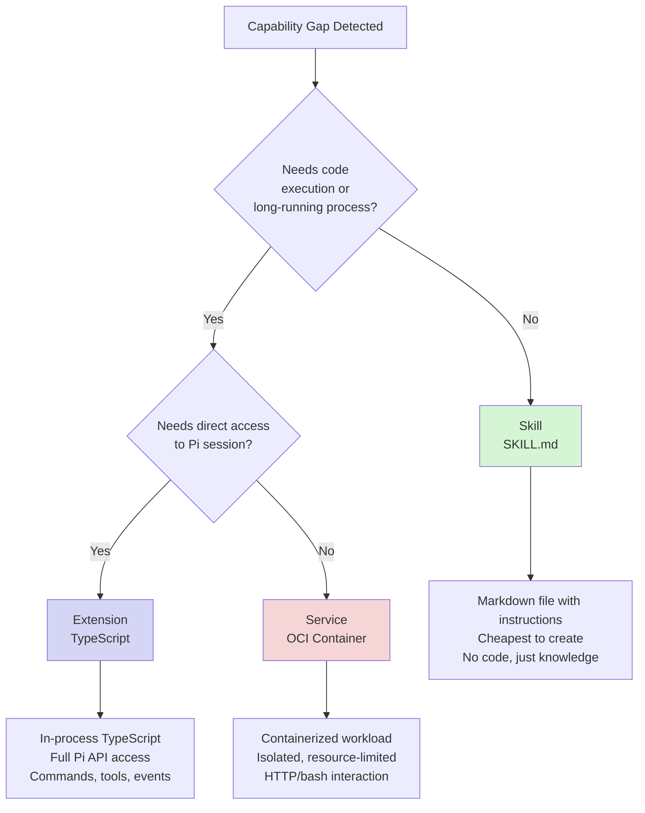
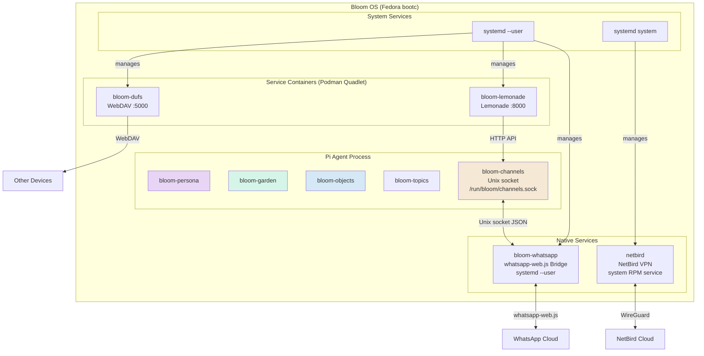
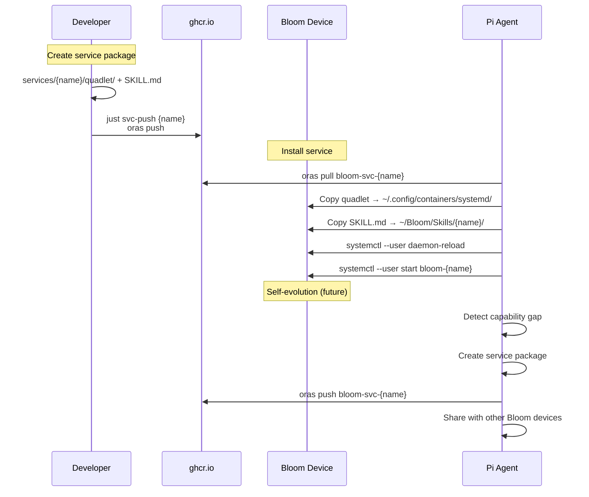
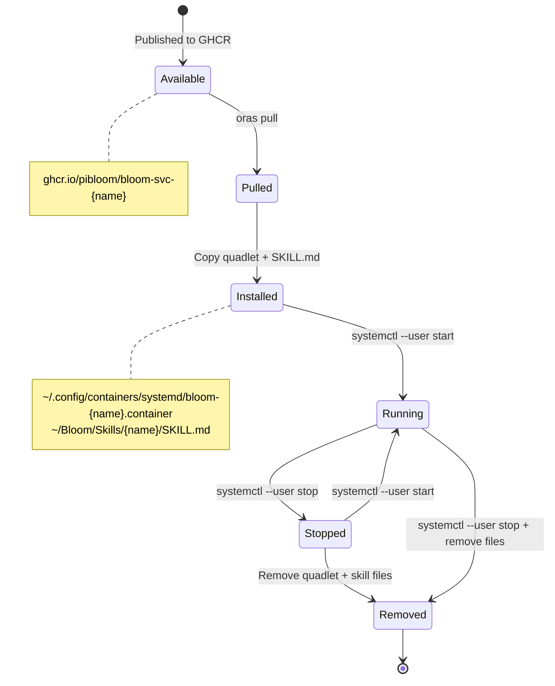
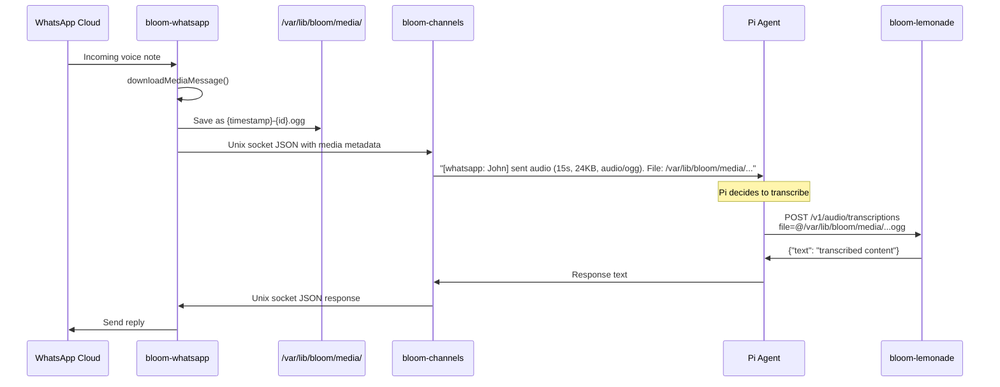
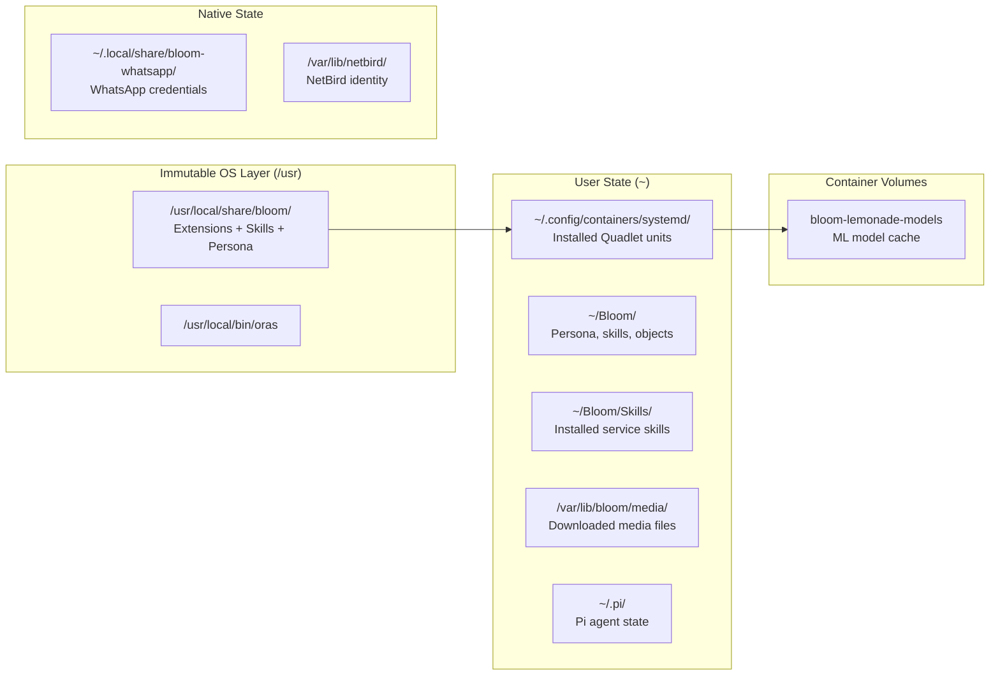

# Service Architecture

> 📖 [Emoji Legend](LEGEND.md)

Bloom extends Pi's capabilities through three mechanisms, each suited to different needs. When Pi detects a capability gap or the user requests a new feature, choose the lightest mechanism that fits.

## 🌱 Extensibility Hierarchy



### 🌱 When to Use What

| Mechanism | Use When | Examples | Cost |
|-----------|----------|----------|------|
| **Skill** | Pi needs knowledge or a procedure to follow | meal-planning, troubleshooting guides, API references | Zero — just a markdown file |
| **Extension** | Pi needs to register commands, tools, or react to session events | bloom-channels (Unix socket server), bloom-objects (object store) | Low — TypeScript, runs in-process |
| **Service** | A standalone process needs to run independently of Pi's session | Lemonade (local LLM), WhatsApp bridge (always-on), dufs (WebDAV) | Medium — systemd unit, resource allocation |

**Always prefer the lighter option.** A skill that teaches Pi to call an existing API is better than an extension wrapping that API, which is better than a service re-implementing it.

## 🌱 System Overview



## 🌱 The Three Layers

| Layer | Mechanism | Lifecycle | Communication | Created By |
|-------|-----------|-----------|---------------|------------|
| **Skills** | Markdown files (SKILL.md) | Discovered at session start | Pi reads and follows instructions | Pi (via `skill_create`) or developer |
| **Extensions** | In-process TypeScript | Loaded with Pi session | Direct API (ExtensionAPI) | Developer (requires code review + PR) |
| **Services** | Containers (Podman Quadlet) or native systemd units | systemd-managed, independent | Unix socket, HTTP, shell | Pi (via self-evolution) or developer |

### 🌱 Why Three Layers?

- **Skills** are pure knowledge — procedures, API references, troubleshooting guides. Pi reads them and acts. No code, no process, no resources. Pi can create these autonomously.
- **Extensions** need direct access to Pi's session (send messages, register commands, access context). They run in-process and require TypeScript. These are core platform code.
- **Services** are standalone workloads (speech-to-text, messaging bridges, mesh VPN, file sync) that run as either containers (for isolation) or native systemd units (when container overhead is unnecessary). Pi can create and distribute containerized services via OCI artifacts.

### 📦 The `bloom-` Prefix

Bloom-managed services use a `bloom-` prefix on their **unit names** (e.g., `bloom-lemonade`, `bloom-whatsapp`). This is a management namespace — it does NOT mean the underlying image is Bloom-specific. Some services run as containers, others as native systemd units, and NetBird runs as a system-level RPM service:

| Unit Name | Type | Image / Runtime | Bloom-specific? |
|-----------|------|-----------------|-----------------|
| `bloom-lemonade` | Podman Quadlet (user) | `ghcr.io/lemonade-sdk/lemonade-server:latest` | No — upstream image |
| `bloom-dufs` | Podman Quadlet (user) | `docker.io/sigoden/dufs:latest` | No — upstream image |
| `bloom-whatsapp` | Native systemd (user) | Node.js + whatsapp-web.js | Yes — custom bridge |
| `netbird` | System RPM service | NetBird package | No — upstream RPM |

The prefix enables:
- `systemctl --user status bloom-*` — list all Bloom-managed user services
- Clear separation from user-installed services

## 📦 OCI Artifact Distribution

Service packages are distributed as OCI artifacts via GHCR, using `oras` for push/pull.



### 📦 Package Format

```
services/{name}/
├── quadlet/
│   ├── bloom-{name}.container    # Podman Quadlet unit
│   └── bloom-{name}-*.volume     # Volume definitions
└── SKILL.md                      # Skill file (frontmatter + API docs)
```

### 📦 Service Catalog

`services/catalog.yaml` is the declarative metadata index for install automation:

- default service versions
- OCI artifact references (`bloom-svc-*`)
- runtime image references
- preflight requirements (for example `oras` and `podman` for container services)

The `manifest_apply` tool uses this catalog to auto-install missing services and enforce preflight checks.

### 📦 OCI Annotations

```
org.opencontainers.image.title       = bloom-{name}
org.opencontainers.image.description = Human-readable description
org.opencontainers.image.source      = https://github.com/pibloom/pi-bloom
org.opencontainers.image.version     = 1.0.0
dev.bloom.service.category           = media | communication | networking | sync
dev.bloom.service.port               = 8000
```

## 📦 Service Lifecycle



## 📡 Media Pipeline

When WhatsApp receives a voice note or image, the media flows through multiple services:



### 📡 Media Message Format (Channel Protocol)

```json
{
  "type": "message",
  "channel": "whatsapp",
  "from": "John",
  "timestamp": 1709568000,
  "media": {
    "kind": "audio",
    "mimetype": "audio/ogg",
    "filepath": "/var/lib/bloom/media/1709568000-abc123.ogg",
    "duration": 15,
    "size": 24576,
    "caption": null
  }
}
```

## 🗂️ File System Layout



## 📦 Available Services

| Service | Category | Port | Type | Image / Runtime | Resources |
|---------|----------|------|------|-----------------|-----------|
| bloom-lemonade | ai | 8000 | Podman Quadlet | ghcr.io/lemonade-sdk/lemonade-server:latest | 2GB RAM |
| bloom-dufs | sync | 5000 | Podman Quadlet | docker.io/sigoden/dufs:latest | 64MB RAM |
| bloom-whatsapp | communication | — | Native systemd (user) | Node.js + whatsapp-web.js | 128MB RAM |
| netbird | networking | — | System RPM service | NetBird package | 256MB RAM |

## 📦 Adding a New Service

1. Create `services/{name}/quadlet/bloom-{name}.container` with Quadlet conventions
2. Create `services/{name}/SKILL.md` documenting the API and usage
3. Test locally: copy to `~/.config/containers/systemd/`, reload, start
4. Push to GHCR: `just svc-push {name}`
5. Update the services table in `services/README.md` and `AGENTS.md`

### 📦 Quadlet Conventions Checklist

- [ ] Container name: `bloom-{name}`
- [ ] Network: prefer `bloom.network` isolation (`host` only when required, e.g. VPN)
- [ ] Health check defined (`HealthCmd`, `HealthInterval`, `HealthRetries`)
- [ ] Logging: `LogDriver=journald`
- [ ] Security: `NoNewPrivileges=true`
- [ ] Restart policy: `on-failure` with `RestartSec=10`
- [ ] Resource limits set (`--memory`)
- [ ] `WantedBy=default.target` in `[Install]`

## 🔗 Related

- [Emoji Legend](LEGEND.md) — Notation reference
- [Channel Protocol](channel-protocol.md) — Unix socket IPC spec
- [Supply Chain](supply-chain.md) — Artifact trust and releases
- [Quick Deploy](quick_deploy.md) — OS build and deployment
