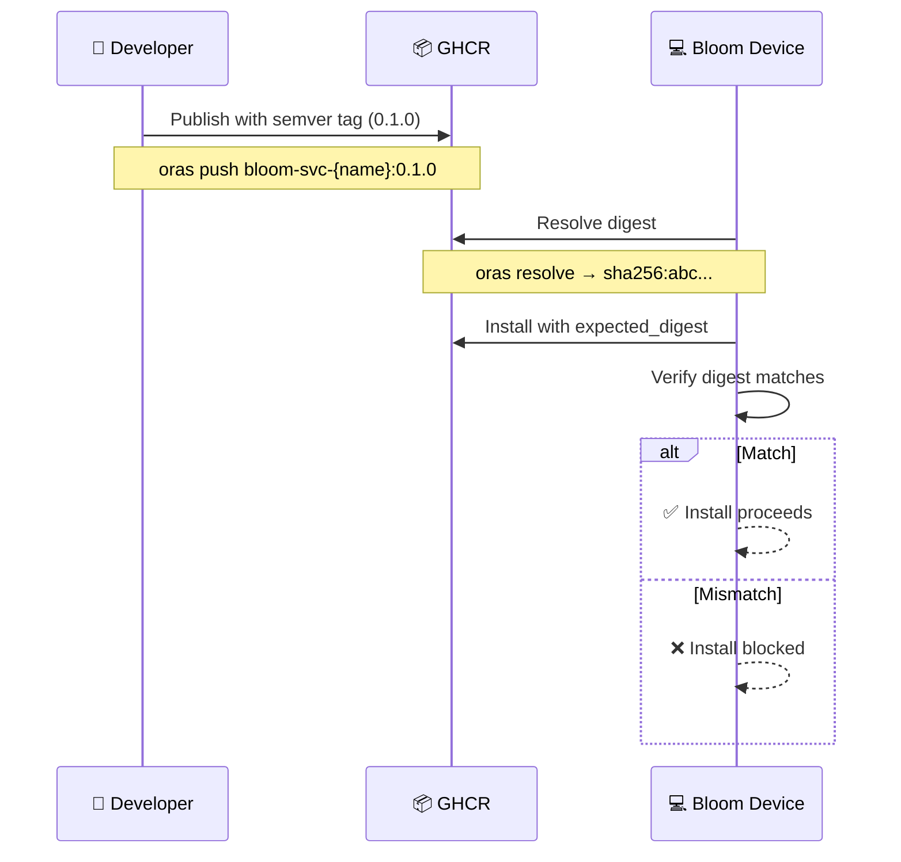

# Supply Chain & Reproducibility Policy

> 📖 [Emoji Legend](LEGEND.md)

This document defines Bloom's baseline supply-chain controls for bootc images and OCI service packages.

## 🛡️ Goals

- Reproducible installs
- Drift-resistant runtime images
- Explicit trust decisions for mutable tags

## 📦 Service Package Policy (OCI Artifacts)

1. Publish service artifacts with immutable semver tags (e.g. `0.1.0`).
2. Treat `latest` as development-only.
3. Prefer digest verification at install time:
   - Resolve digest: `oras resolve ghcr.io/pibloom/bloom-svc-{name}:{version}`
   - Install with verification: `service_install(..., expected_digest="sha256:...")`

### 🛡️ Tooling Enforcement

`service_install` enforces:

- `version=latest` blocked by default (`allow_latest=true` required to override)
- Optional artifact digest verification via `expected_digest`
- Pinned runtime image policy from service `SKILL.md` frontmatter image field

## 📦 Runtime Image Policy (Quadlet)

Service container images must be pinned:

- Preferred: digest (`image@sha256:...`)
- Acceptable: explicit non-latest tag
- Disallowed: implicit latest / `latest*` tags

### 📦 Current Exceptions

- None.

## 💻 bootc Image Policy

- Base image is pinned by digest in `os/Containerfile`.
- Global npm CLIs in OS image are pinned to explicit versions.
- Build context excludes nested `node_modules` and worktrees.

## 🚀 Release Checklist

- [ ] Service artifacts published with semver tags
- [ ] Quadlet images pinned (digest preferred)
- [ ] `service_test` passes for each service
- [ ] `service_install` tested with `expected_digest`
- [ ] Docs updated when image/digest references change

## 🔗 Related

- [Emoji Legend](LEGEND.md) — Notation reference
- [Service Architecture](service-architecture.md) — Extensibility hierarchy details
- [AGENTS.md](../AGENTS.md#services-oci-packages) — Service reference
